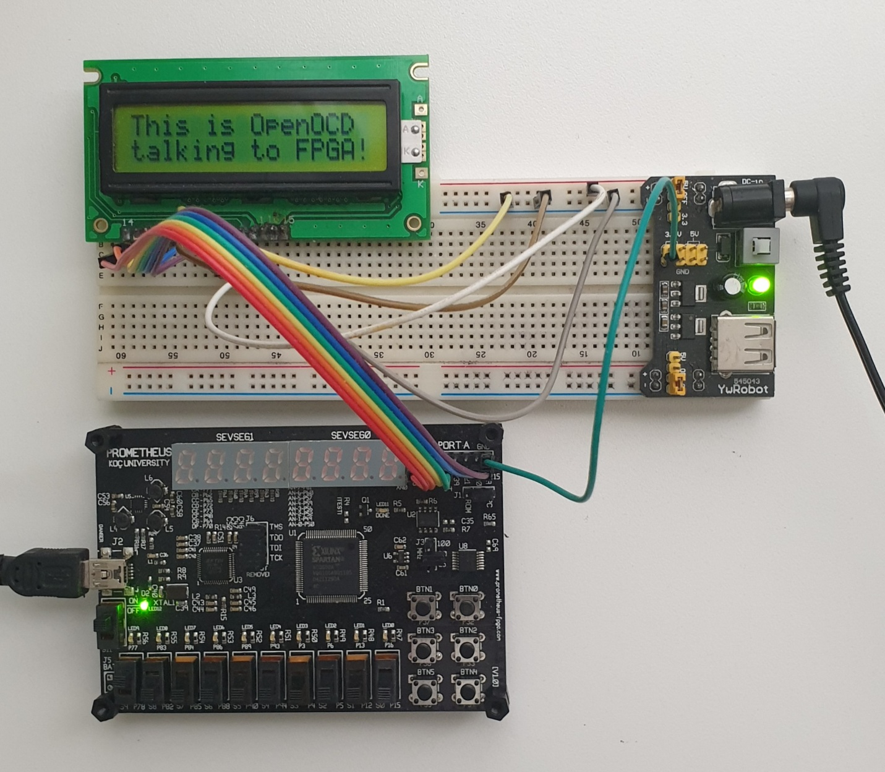
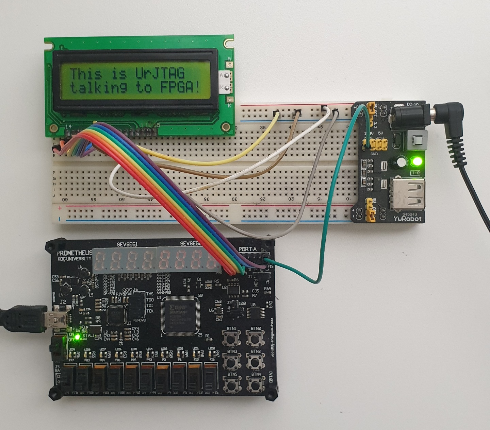

# BScan_LCD_Test
JTAG to 2x16 LCD driver circuit (via BSCAN USER1 register).
The circuit receives 32 ASCII characters from the TDI input of the built-in JTAG Test Access Point interface and displays them on a 2x16 LCD.

Target Devices: xc3s50a, vq100 package (Prometheus FPGA development board)

Dependencies: LCDDriver4bit.vhdl by A. Greensted (modified)

## Sending ASCII text to FPGA using OpenOCD
Run OpenOCD with the cable configuration file (FT232H.cfg) and the sender script (Prometheus_BScan.cfg):

    $ openocd -f FT232H.cfg -f Prometheus_BScan.cfg
    Open On-Chip Debugger 0.11.0
    Licensed under GNU GPL v2
    For bug reports, read
	http://openocd.org/doc/doxygen/bugs.html
    send_seq
    Info : Listening on port 6666 for tcl connections
    Info : Listening on port 4444 for telnet connections
    Info : clock speed 6000 kHz
    Info : JTAG tap: spartan3a.tap tap/device found: 0x02210093 (mfg: 0x049 (Xilinx), part: 0x2210, ver: 0x0)
    Warn : gdb services need one or more targets defined

Connect to OpenOCD in another terminal:

    $ telnet localhost 4444
    > Trying 127.0.0.1...
    Connected to localhost.
    Escape character is '^]'.
    Open On-Chip Debugger

Send some text to FPGA in OpenOCD terminal:

    > send_seq "This is OpenOCD talking to FPGA!"
    0000000000000000000000000000000000000000000000000000000000000000
    > send_seq "This is OpenOCD talking to FPGA!"
    54686973206973204f70656e4f43442074616c6b696e6720746f204650474121

Returned hexademical string represents previous value of SHIFT_REGISTER. You can decode it using ASCII table.

## Sending ASCII text to FPGA using UrJTAG

Make sure that your text is exactly 32 characters long:

    $ echo -n "This is UrJTAG  talking to FPGA\!" | wc -c
    32

Find the binary representation of the string, its length will be 256 (8x32) bits:

    $ echo -n "This is UrJTAG  talking to FPGA\!" | xxd -b -c 1 | cut -f 2 -d" " | paste -s -d ""
    0101010001101000011010010111001100100000011010010111001100100000010101010111001001001010010101000100000101000111001000000010000001110100011000010110110001101011011010010110111001100111001000000111010001101111001000000100011001010000010001110100000100100001

Alternatively, use a Perl script for the conversion:

    $ echo -n "This is UrJTAG  talking to FPGA\!" | perl -lpe '$_=unpack"B*"'
    0101010001101000011010010111001100100000011010010111001100100000010101010111001001001010010101000100000101000111001000000010000001110100011000010110110001101011011010010110111001100111001000000111010001101111001000000100011001010000010001110100000100100001

Start UrJTAG:

    $ jtag

    UrJTAG 2021.03 #
    Copyright (C) 2002, 2003 ETC s.r.o.
    Copyright (C) 2007, 2008, 2009 Kolja Waschk and the respective authors

    UrJTAG is free software, covered by the GNU General Public License, and you are
    welcome to change it and/or distribute copies of it under certain conditions.
    There is absolutely no warranty for UrJTAG.

    warning: UrJTAG may damage your hardware!
    Type "quit" to exit, "help" for help.

Specify the cable and detect the devices in the JTAG chain:

    jtag> cable ft2232 vid=0x0403 pid=0x6014
    Connected to libftdi driver.
    jtag> detect
    IR length: 6
    Chain length: 1
    Device Id: 00000010001000010000000010010011 (0x02210093)
      Manufacturer: Xilinx (0x093)
      Part(0):      xc3s50a (0x2210)
      Stepping:     0
      Filename:     /usr/share/urjtag/xilinx/xc3s50a/xc3s50a

Specify the length of the data register ("SHIFT_REGISTER" defined in the VHDL file) in bits:

    jtag> register USER1_REG 256

Define the instruction for JTAG Test Access Point which activates data register USER1 which is specified in the VHDL design ("SHIFT_REGISTER"):

    jtag> instruction USER1 000010 USER1_REG

USER1 instruction is described in: "*UG332 Spartan-3 Generation Configuration User Guide*", p. 207, Table 9-5: *Spartan-3 Generation Boundary-Scan Instructions*.

Select and execute previously defined instruction:

    jtag> instruction USER1
    jtag> shift ir

Now TDI is redirected to the data register USER1. Set data register's future content to the desired text in binary form and shift the data over TDI:

    jtag> dr 0101010001101000011010010111001100100000011010010111001100100000010101010111001001001010010101000100000101000111001000000010000001110100011000010110110001101011011010010110111001100111001000000111010001101111001000000100011001010000010001110100000100100001
    jtag> shift dr

## Copyright and License
Author: Altynbek Isabekov

License: GNU GPL v2
